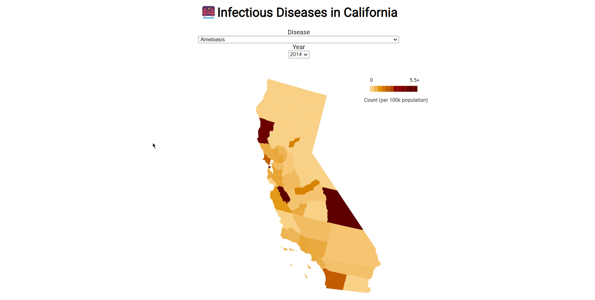

# The Impact of Quality of Life on Infectious Diseases

This project is intended to analyse the relationship between rate of infectious disease and Health-Related quality of life, specifically, in California. 

## 📚Dataset

### Health-Related Quality of Life (1993 - 2010)

📖https://data.world/health/health-related-quality-of-life

1993 - 2010. Centers for Disease Control and Prevention (CDC).

Data are from the Behavioral Risk Factor Surveillance System (BRFSS). All respondents to the BRFSS are non-institutionalized adults, 18 years old or older.

HRQOL surveillance is used to identify unmet population health needs including recognizing trends, disparities, and determinants of health in the population. HRQOL surveillance data can be used to inform decision making, and program and policy development. To assure that the population is benefiting from public health programs, HRQOL surveillance data can be used for program evaluation.

A compact set of [HRQOL measures](http://www.cdc.gov/hrqol/methods.htm) including a summary [measure of unhealthy days](https://www.cdc.gov/hrqol/pdfs/mhd.pdf) have been developed and validated for population health surveillance and have been widely used since 1993.

Attribution: [Centers for Disease Control and Prevention](https://catalog.data.gov/dataset/behavioral-risk-factor-data-health-related-quality-of-life-hrqol-76ea6).

### Infectious Disease (2001-2014)

📖https://data.world/health/infectious-disease-2001-2014

These data contain counts and rates for Centers for Infectious Diseases-related disease cases among California residents by county, disease, sex, and year spanning 2001-2014 (As of September, 2015).

Attribution: [HealthData.gov](http://www.healthdata.gov/dataset/infectious-disease-cases-county-year-and-sex-2001-2014) and [CHHS Open Data](http://www.healthdata.gov/dataset/infectious-disease-cases-county-year-and-sex-2001-2014).

## 🌱Deployment

The webpage is written using D3.js and React.js.

Check out our [project page](https://quality-of-life.netlify.app/) hosted on Netlify! 

📸Screenshots:

 Webpage Overview 

 

 Health Related Quality of Life Chart and Pie Chart

 

 Health Related Quality of Life USA Choropleth Map 

 

 Rate of Infectious Diseases in California

 

 Infectious Diseases California Choropleth Map 

 

 Interesting Patterns Found 

 